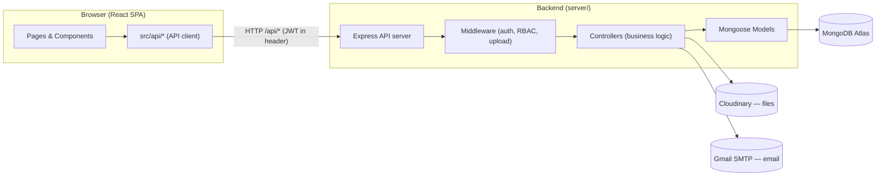
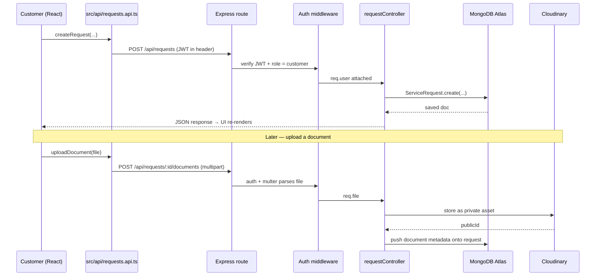

# Mahabharat Consultancy — One Stop Service Center

A full-stack **MERN** web application for an internet café / online-services center.
Customers request government & online services (Aadhaar, PAN, GST, exam/job forms,
printing, bill payments, etc.), upload documents, pay, and download completed
deliverables. Agents process the requests; admins manage everything.

> **Disclaimer shown in-app:** Mahabharat Consultancy is a private assistance / service
> center — *not* a government agency. It only helps users apply on official portals.

---

## Tech Stack

| Layer        | Technology                                                                 |
|--------------|----------------------------------------------------------------------------|
| Frontend     | React 19 + TypeScript + Vite, Tailwind CSS, shadcn/ui, GSAP (animations)   |
| Routing      | React Router (HashRouter)                                                  |
| Backend      | Node.js + Express                                                          |
| Database     | MongoDB (MongoDB Atlas in production) via Mongoose                         |
| Auth         | JWT (stateless), bcrypt password hashing, role-based access control        |
| File storage | Cloudinary (private/authenticated assets) with local-disk fallback        |
| Email        | Nodemailer over Gmail SMTP (welcome + password-reset emails)               |

---

## High-Level Architecture



The **golden rule**: the frontend never talks to the database directly. It only calls
`src/api/*`, which call the backend routes → middleware → controllers → models → database.
Each layer has exactly one job.

---

## Project Structure

```
Mahabharat-Consultancy/
├── index.html                  # SPA entry HTML
├── package.json                # Frontend deps & scripts
├── vite.config.ts              # Vite config (base path + /api dev proxy)
├── tailwind.config.js          # Theme (navy/gold), fonts
├── tsconfig*.json              # TypeScript configs
├── public/                     # Static assets served as-is
├── dist/                       # Production build output (generated)
│
├── src/                        # ─────────── FRONTEND ───────────
│   ├── main.tsx                # App entry: mounts React + router
│   ├── App.tsx                 # Routes + layout (Navbar/Footer/mobile menu)
│   ├── index.css               # Theme tokens (navy/gold) + fonts
│   │
│   ├── pages/                  # One file per screen
│   │   ├── Home, Services, ServiceDetail, GovtJobs, Login, Signup
│   │   ├── customer/           # Dashboard, NewRequest, RequestDetail
│   │   ├── agent/              # AgentDashboard, TaskDetail
│   │   └── admin/              # Dashboard, Requests, Customers, Agents,
│   │                           #   Payments, Audit, Reports, Services, …
│   │
│   ├── components/             # Reusable UI
│   │   ├── Navbar, Footer, StatusBadge, StatusTimeline, WhatsAppButton
│   │   ├── DeleteAccountCard, ForgotPasswordDialog
│   │   ├── AnimatedList, Masonry, StaggeredMenu, MagicBento  # visual effects
│   │   └── ui/                 # shadcn/ui primitives (Button, Dialog, Input, …)
│   │
│   ├── api/                    # THE ONLY place that calls the backend
│   │   ├── auth, services, requests, payments, users
│   │   └── calls, jobs, stats, notifications, audit
│   │
│   ├── context/AuthContext.tsx # Logged-in user state (login/register/logout/delete)
│   ├── lib/apiClient.ts        # Axios instance + JWT token storage
│   ├── config/site.ts          # Shop info (email, phone, address)
│   ├── data/                   # Static catalogs (service icons, govt jobs)
│   ├── hooks/                  # Reusable hooks
│   ├── types/index.ts          # Shared TypeScript types
│   └── assets/services/        # Service logo images
│
└── server/                     # ─────────── BACKEND ───────────
    ├── .env                    # Secrets (gitignored — never committed)
    ├── .env.example            # Template for the above
    ├── package.json            # Backend deps & scripts
    └── src/
        ├── index.js            # Entry: connect DB, start HTTP server
        ├── app.js              # Express app: middleware + mount routes
        ├── seed.js             # Populate DB with starter data
        │
        ├── config/
        │   ├── env.js          # Reads & validates environment variables
        │   ├── db.js           # MongoDB / Atlas connection
        │   └── cloudinary.js   # Cloudinary SDK client
        │
        ├── routes/index.js     # ALL API endpoints in one router
        │
        ├── controllers/        # Business logic behind each route
        │   ├── authController       # register, login, me, deleteMyAccount,
        │   │                         #   forgotPassword, resetPassword
        │   ├── requestController, serviceController, paymentController
        │   ├── userController, miscController
        │
        ├── models/             # Mongoose schemas (the database shape)
        │   ├── User, ServiceRequest, Payment, Service
        │   ├── Profiles (Customer/Agent), Activity (Audit/Notification/CallLog)
        │   └── index.js
        │
        ├── middleware/
        │   ├── auth.js         # JWT verification + role checks (RBAC)
        │   ├── upload.js       # Multer file-upload handling
        │   └── error.js        # Central error formatting
        │
        ├── utils/
        │   ├── mailer.js       # Nodemailer (welcome + reset emails)
        │   ├── storage.js      # Persist/stream/delete files (Cloudinary/local)
        │   ├── serializers.js  # Shape DB docs for API responses
        │   ├── apiError.js, helpers.js
        │
        └── data/               # Seed catalogs (services, jobs)
```

---

## Request Workflow (end to end)

Example: a customer submits a new service request and later downloads the result.



**Service lifecycle (status flow):**
`submitted → documents_required → in_review → in_progress → waiting_otp →
waiting_payment → completed → delivered` (or `rejected` / `cancelled`).

Agents move a request through these states; payment is required before the
customer can download final deliverables.

---

## How the pieces connect

### Frontend → Backend API calls
- The browser only talks to **one origin**. In dev, [vite.config.ts](vite.config.ts)
  proxies every `/api/*` request to the backend at `http://localhost:5000`.
- [src/lib/apiClient.ts](src/lib/apiClient.ts) is an Axios instance that automatically
  attaches the JWT (`Authorization: Bearer <token>`) from local storage to every request.
- Each `src/api/*.ts` file wraps a group of endpoints (auth, services, requests, …)
  so components call typed functions like `Req.createRequest(...)` instead of raw URLs.

### MongoDB Atlas (database)
- All persistent data lives in MongoDB. In production this is **MongoDB Atlas** (cloud).
- The connection string is read from `MONGODB_URI` in `server/.env`
  ([config/db.js](server/src/config/db.js)).
- Mongoose **models** (`server/src/models/`) define the schema for each collection:
  `users`, `servicerequests`, `payments`, `services`, profiles, and activity logs.
- For zero-config local dev you can leave `MONGODB_URI` blank — the server spins up an
  in-memory MongoDB automatically.
- **Atlas note (free M0 tier):** 512 MB storage (plenty, since files live in Cloudinary,
  not Mongo), no automated backups, may auto-pause after long inactivity. Enable backups
  and tighten network access before going live.

### Cloudinary (file storage)
- Uploaded documents and final deliverables are **not** stored in MongoDB. They go to
  **Cloudinary** as **private / authenticated** assets ([utils/storage.js](server/src/utils/storage.js)).
- Only the file **metadata** (Cloudinary `publicId`, type, name) is saved on the request
  document in Mongo.
- Downloads are served via short-lived **signed URLs**, gated behind auth + payment checks —
  files are never publicly accessible.
- If Cloudinary credentials are absent, storage falls back to the local `uploads/` disk folder.

### Email (Gmail SMTP)
- [utils/mailer.js](server/src/utils/mailer.js) sends a **welcome email** on signup and a
  **6-digit password-reset code** on "Forgot password" — via the shop's Gmail using an
  **App Password** (`EMAIL_USER` / `EMAIL_PASS`). No paid third-party service.

---

## User Roles (RBAC)

| Role     | Can do                                                                       |
|----------|------------------------------------------------------------------------------|
| Customer | Sign up, create requests, upload documents, pay, download deliverables, self-delete account |
| Agent    | View assigned tasks, process them, upload deliverables, request masked calls, self-delete (if no active tasks) |
| Admin    | Manage services, assign agents, approve payments, manage users, view stats & audit logs |

Enforced by [middleware/auth.js](server/src/middleware/auth.js) (`requireAuth`, `requireRole`).

---

## Environment Variables (`server/.env`)

> Copy `server/.env.example` → `server/.env` and fill in. **Never commit `.env`.**

| Variable | Purpose |
|----------|---------|
| `PORT` | Backend port (default 5000) |
| `NODE_ENV` | `development` / `production` |
| `CLIENT_URL` | Frontend origin allowed by CORS |
| `MONGODB_URI` | MongoDB Atlas connection string (blank = in-memory dev DB) |
| `JWT_SECRET` | Secret for signing JWTs (use a long random string) |
| `JWT_EXPIRES_IN` | Token lifetime, e.g. `7d` |
| `MAX_UPLOAD_MB` | Max upload size |
| `UPLOAD_DIR` | Local fallback folder for uploads |
| `CLOUDINARY_CLOUD_NAME` / `CLOUDINARY_API_KEY` / `CLOUDINARY_API_SECRET` | Cloudinary credentials (file storage) |
| `EMAIL_USER` / `EMAIL_PASS` / `EMAIL_FROM_NAME` | Gmail SMTP (App Password) for emails |
| `CALL_PROVIDER` | Masked-calling provider (`stub` by default) |

---

## Getting Started (local development)

**Prerequisites:** Node.js 18+, and either a MongoDB Atlas URI or nothing (in-memory DB).

```bash
# 1) Backend
cd server
cp .env.example .env        # then fill in values (or leave MONGODB_URI blank)
npm install
npm run seed                # optional: load starter services/users
npm run dev                 # starts API on http://localhost:5000

# 2) Frontend (in a second terminal, from the project root)
npm install                 # or: pnpm install
npm run dev                 # starts Vite on http://localhost:5173
```

Open **http://localhost:5173/Mahabharat-Consultancy/**

| Script (frontend) | Does |
|---|---|
| `npm run dev` | Start Vite dev server |
| `npm run build` | Production build → `dist/` |
| `npm run preview` | Preview the production build |
| `npm run lint` | Run ESLint |

| Script (server) | Does |
|---|---|
| `npm run dev` | Start API with auto-reload (nodemon) |
| `npm start` | Start API (plain node) |
| `npm run seed` | Seed the database |

---

## API Endpoints (reference)

Base path: `/api`. 🔒 = requires JWT; roles noted where restricted.

**Auth & account**
```
POST   /auth/register            Register a customer
POST   /auth/login               Login (email or phone + password)
POST   /auth/forgot-password     Email a 6-digit reset code
POST   /auth/reset-password      Verify code + set new password
GET    /auth/me              🔒  Current user
DELETE /account              🔒  Delete own account (customer/agent)
```

**Services & jobs**
```
GET    /services/categories      List categories
GET    /services                 List services
GET    /services/:id             One service
POST   /services             🔒 admin   Create
PATCH  /services/:id         🔒 admin   Update
PATCH  /services/:id/toggle  🔒 admin   Enable/disable
GET    /jobs                     Govt job listings
```

**Requests** (all 🔒)
```
GET    /requests                         List (scoped by role)
POST   /requests             customer    Create
GET    /requests/:id                     One request
PATCH  /requests/:id                     Update
PATCH  /requests/:id/status              Change status
PATCH  /requests/:id/assign  admin       Assign agent
PATCH  /requests/:id/ready   agent/admin Mark ready for payment
POST   /requests/:id/comments            Add comment
POST   /requests/:id/documents           Upload document (multipart)
DELETE /requests/:id/documents/:docId    Remove document
GET    /requests/:id/documents/:docId/download
POST   /requests/:id/deliverables  agent/admin   Upload deliverable
GET    /requests/:id/deliverables/:delId/download
POST   /requests/:id/pay     customer    Record a payment
PATCH  /requests/:id/payment/received  admin  Confirm payment
POST   /requests/:id/call-requests agent/admin  Request masked call
GET    /requests/:id/calls               List calls
PATCH  /requests/:id/calls/:callId/complete  agent/admin
```

**Admin / misc** (🔒 admin unless noted)
```
GET    /payments                 List payments
GET    /users/customers          List customers
GET    /users/agents             List agents
POST   /users/agents             Create agent
PATCH  /users/:id/active         Activate/deactivate
PATCH  /users/:id                Update user
DELETE /users/:id                Delete user
GET    /stats/admin              Dashboard stats
GET    /stats/agents             Agent performance
GET    /audit                    Audit log
GET    /call-requests            Pending masked-call requests
PATCH  /call-requests/:callId    Approve/deny call
GET    /notifications        🔒  Current user's notifications
PATCH  /notifications/read-all 🔒
PATCH  /notifications/:id/read 🔒
GET    /health                   Health check
```

---

## Deployment notes

- **Backend** → host on Render / Railway / Fly.io with environment variables set there
  (do not commit `.env`). Point `MONGODB_URI` at MongoDB Atlas.
- **Frontend** → `npm run build` then deploy `dist/`. If using **GitHub Pages**, the
  `base` path in [vite.config.ts](vite.config.ts) must match the repo name
  (currently `/Mahabharat-Consultancy/`). Set `VITE_PROXY_TARGET` / the API base to the
  deployed backend URL.
- Rotate any credentials that were ever shared in plain text before going to production.
```
